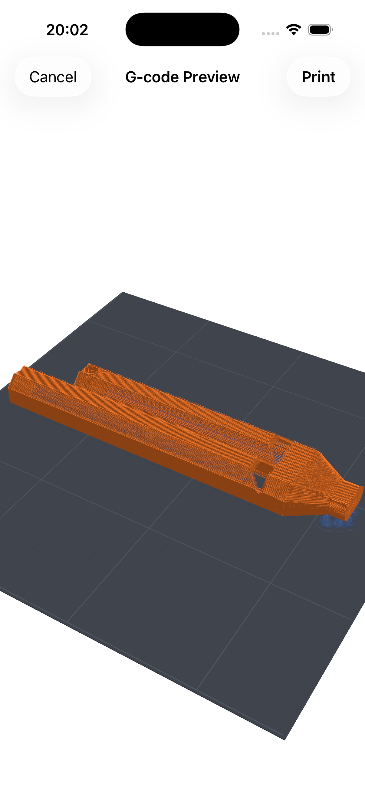

# GCodePreview

A Swift Package for parsing G-code and rendering 3D print previews using SceneKit. Supports iOS 17+ and macOS 14+.

<p align="center">
  
</p>

## Features

- **G-code parsing** — Supports G0/G1 linear moves, G2/G3 arc moves, absolute/relative positioning, retraction tracking, and move type classification (perimeter, infill, support, skirt)
- **3D scene rendering** — Builds a SceneKit scene with color-coded filament paths, a build plate with grid lines, lighting, and an automatic camera
- **SwiftUI view** — Drop-in `GCodePreviewView` with orbit/turntable camera controls for both iOS and macOS
- **Layer-by-layer access** — Query individual print layers, segment counts, and build dimensions

## Installation

Add the package to your project via Swift Package Manager:

```swift
dependencies: [
    .package(url: "https://github.com/leolobato/GCodePreview.git", from: "1.0.0")
]
```

## Usage

### Parse G-code and render a preview

```swift
import GCodePreview

let gcode = try String(contentsOf: gcodeFileURL, encoding: .utf8)

let parser = GCodeParser()
let model = try parser.parse(gcode)

let builder = PrintSceneBuilder()
let scene = builder.buildScene(from: model)

// In SwiftUI:
GCodePreviewView(scene: scene)
```

### Custom color palette

Filament and support colors are configurable via `ColorPalette`. Colors are cycled when there are more filaments than palette entries.

```swift
let palette = ColorPalette(filamentColors: [
    .init(red: 0.88, green: 0.27, blue: 0.24),  // Red
    .init(red: 0.16, green: 0.65, blue: 0.36),  // Green
    .init(red: 0.94, green: 0.70, blue: 0.18),  // Yellow
], supportColor: .init(red: 0.5, green: 0.5, blue: 0.5, alpha: 0.5))

let builder = PrintSceneBuilder(palette: palette)
```

### Limit rendering to a specific layer

```swift
let model = try parser.parse(gcode, maxLayer: 42)
```

## Requirements

- iOS 17.0+ / macOS 14.0+
- Swift 5.9+

## License

GCodePreview is available under the MIT License. See [LICENSE](LICENSE) for details.
